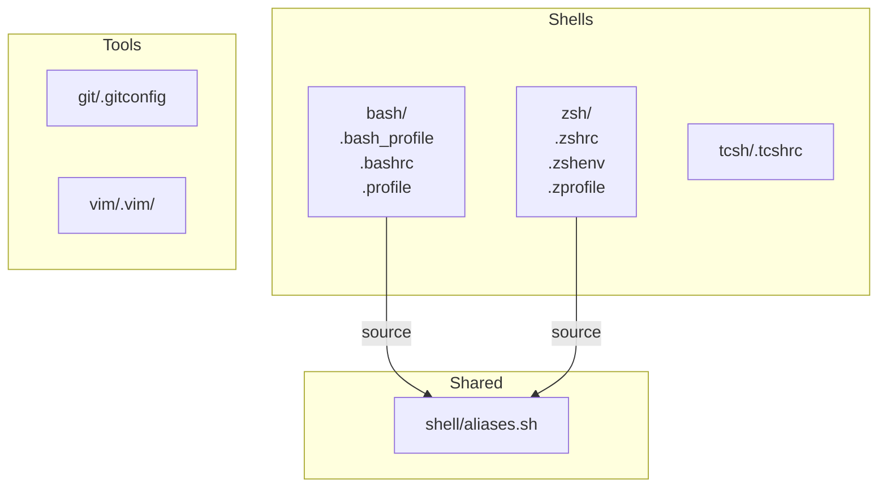

# UML

Last updated: 2026-05-13

## Overview

Personal dotfiles repo. Each top-level directory groups config files for one shell or tool. The shared `shell/aliases.sh` is sourced by both bash and zsh rc files, providing a single source of truth for cross-shell aliases.

## Structure

## Components

- **bash/** — bash startup files (`.bash_profile`, `.bashrc`, `.profile`); sources `shell/aliases.sh`.
- **zsh/** — zsh startup files (`.zshrc`, `.zshenv`, `.zprofile`); sources `shell/aliases.sh`; sets PATH for local bin and postgresql@16.
- **tcsh/** — `.tcshrc` for tcsh users.
- **shell/aliases.sh** — cross-shell aliases (currently `ls -al`).
- **git/.gitconfig** — git user identity, push defaults.
- **vim/.vim/** — vim runtime artifacts (netrwhist).

## Conventions

- Files in each directory are intended to be symlinked into `$HOME` (no install script present yet).
- Aliases that should apply to multiple shells go in `shell/aliases.sh`, not in individual rc files.

## Last activity

- 2026-05-13: bootstrapped planning-first harness (`.pi/`, `docs/adr/`, `plans/`, `CONTEXT.md`, `README.md`, ADR seed) and created initial `UML.md`. Files: `.pi/`, `CONTEXT.md`, `README.md`, `docs/adr/0000-record-architecture-decisions.md`, `.gitignore`, `UML.md`.
