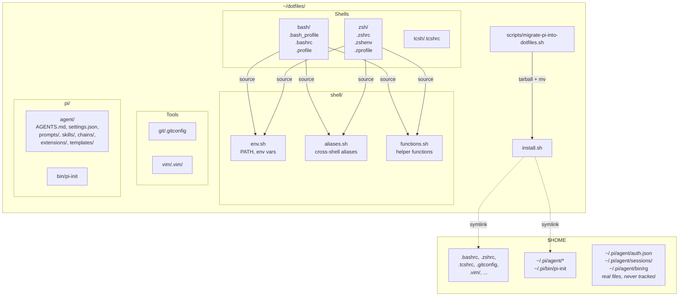

# UML — dotfiles

_Last updated: 2026-05-21 — added `f` (friendly find wrapper) to functions.sh_

## Overview

Personal dotfiles repo. Versions shell rc files, git, vim, and pi coding-agent config. A single `install.sh` at the repo root symlinks every tracked file into `$HOME` or `~/.pi/`. Per-entry symlinks (not directory-level) so machine-local state (OAuth tokens, chat history, bundled binaries) stays outside the repo.

## Module map

- `bash/`, `zsh/`, `tcsh/` — shell startup files, symlinked into `$HOME`
- `shell/` — shared `env.sh` (PATH/env), `aliases.sh` (aliases), `functions.sh` (helper functions); sourced by bash + zsh
- `git/`, `vim/` — tool configs, symlinked into `$HOME`
- `pi/agent/` — pi coding-agent config (AGENTS.md, settings, prompts, skills, chains, extensions, templates)
- `pi/bin/pi-init` — project bootstrap script, on PATH via `shell/env.sh`
- `install.sh` — idempotent symlink installer
- `scripts/` — one-time migration helpers
- `docs/adr/` — architecture decision records

## Structure

## Components

- **bash/**, **zsh/**, **tcsh/** — shell startup files. bash and zsh source `shell/env.sh` then `shell/aliases.sh`. tcsh has inline PATH for `pi/bin/`.
- **shell/env.sh** — POSIX-sh env-only file. Prepends `~/dotfiles/pi/bin` to `$PATH`. Sourced by bash + zsh.
- **shell/aliases.sh** — cross-shell aliases.
- **shell/functions.sh** — helper functions (`gacp` for git add-commit-push, `hi` for VS Code workspace setup, `f` for friendly find).
- **git/.gitconfig** — git identity and defaults.
- **vim/.vim/** — vim runtime dir (note: `.netrwhist` is local state — flagged for cleanup).
- **pi/agent/** — tracked pi config: `AGENTS.md`, `settings.json`, `prompts/`, `skills/`, `chains/`, `extensions/`, `templates/`. Symlinked entry-by-entry into `~/.pi/agent/`.
- **pi/bin/pi-init** — project bootstrap script. Symlinked into `~/.pi/bin/pi-init` and on `$PATH` via `env.sh`.
- **install.sh** — idempotent installer. `--backup` flag moves conflicts to `~/.dotfiles-backup-<ts>/`.
- **scripts/migrate-pi-into-dotfiles.sh** — one-time per existing machine. Tarballs `~/.pi/` to `~/pi-backup-<ts>.tgz`, moves tracked entries into `pi/`, runs `install.sh`.
- **docs/adr/** — architecture decision records.
- **plans/** — feature plans (planning-first workflow).
- **migration-plan.md** — standalone recovery doc for the pi-into-dotfiles migration; can be read in a fresh session to resume from a broken state.

## Conventions

- One top-level directory per tool. Files inside intended to be symlinked into `$HOME` by `install.sh`.
- Cross-shell env vars / PATH → `shell/env.sh`. Cross-shell aliases → `shell/aliases.sh`. Shell-specific behavior stays in its own dir.
- Per-entry symlinks for `~/.pi/agent/` (not a single directory symlink) so machine-local state coexists with tracked config.
- `install.sh` is idempotent. Re-running must be a no-op.
- Sensitive files (`auth.json`, `sessions/`, `bin/rg`) are never tracked, even defensively under `pi/`.

## Last activity

- 2026-05-21: added `f` function (friendly `find` wrapper) to `shell/functions.sh`. Files: `shell/functions.sh`, `UML.md`.
- 2026-05-15: docs update — rewrote README.md, added functions.sh to UML diagrams and module map, generated UML.html. Files: `README.md`, `UML.md`, `UML.html`.
- 2026-05-13: implemented pi-config-into-dotfiles plan. Added `install.sh`, `scripts/migrate-pi-into-dotfiles.sh`, `shell/env.sh`, `pi/README.md`, ADR 0001. Edited `bash/.bashrc`, `zsh/.zshrc`, `tcsh/.tcshrc` to source `env.sh` / extend PATH. Updated `.gitignore` with defensive entries for `pi/agent/{sessions,auth.json,bin/rg,...}` and backup artifacts. Updated `CONTEXT.md`. The migration itself (moving files out of `~/.pi/`) has **not** been run yet — user runs `bash scripts/migrate-pi-into-dotfiles.sh` when ready. See `migration-plan.md` for the standalone recovery doc.
- 2026-05-13: bootstrapped planning-first harness (`.pi/`, `docs/adr/`, `plans/`, `CONTEXT.md`, `README.md`, ADR seed) and created initial `UML.md`.
