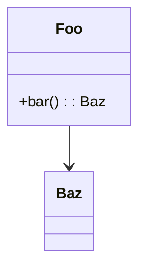

# UML.md Maintenance

`UML.md` is the persistent architectural memory for a project. It lives at the
repo root and is the first thing pi reads when re-entering an existing project.
Keep it small, accurate, and current.

## File structure

A valid `UML.md` has exactly these sections in this order:

```markdown
# UML — <project name>

_Last updated: <ISO-8601 timestamp> — <one-line summary of last change>_

## Overview
1–3 sentences. What this project is, what problem it solves, the dominant
architectural style (e.g. "TypeScript CLI, plugin-based, single-process").

## Module map
A short bullet list of top-level modules / packages and their responsibility.
- `src/foo/` — does X
- `src/bar/` — does Y

## Class / component diagram
A Mermaid `classDiagram` (for OO code) or `flowchart`/`graph` (for service or
data-flow oriented code). Prefer one diagram. Split into a second diagram only
if the first becomes unreadable (> ~25 nodes).



## Key data flows
Optional. 2–5 bullets describing the most important runtime flows
("user prompt → router → tool dispatch → result render").

## Last activity
A reverse-chronological log, newest first, of meaningful work performed in this
project across pi sessions. Cap at the most recent 10 entries; drop older ones.
Each entry:

- `YYYY-MM-DD HH:MM` — one-line summary. Files touched: `a.ts`, `b.ts`.
```

## Update rules

1. **Read before write.** Always read the current UML.md (if any) before editing
   so you preserve hand-edited notes.
2. **Update the timestamp + one-line summary** on every change.
3. **Update the diagram** only when classes / modules / relationships actually
   changed. Cosmetic code changes do not require diagram edits.
4. **Always append to "Last activity"** when finishing a unit of work. Keep
   the entry to one line. Trim the list to 10 entries.
5. **Keep it short.** UML.md is a map, not the territory. Aim for < 200 lines.
6. **Mermaid only.** Do not use PlantUML or ASCII art; the rest of the toolchain
   assumes Mermaid.

## When to create it

If `UML.md` does not exist in a project that already contains source code:
generate a first version by surveying the repo (entry points, top-level
directories, exported types) and producing the sections above. Mark the "Last
activity" log with a single entry: "initial UML generated by pi".
